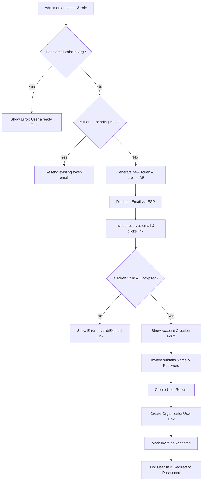

# SaaS User Invitation System
**ID**: SPEC-001
**Version**: 1.0
**Status**: Draft
**Type**: Functional Specification

## Overview & Purpose
The SaaS User Invitation System allows Organization Administrators to invite new users to join their workspace via a secure email link. This feature bridges the gap between account creation and organization membership, ensuring that new users are securely authenticated and automatically associated with the correct tenant upon registration.

## Goals
*   Enable Organization Admins to seamlessly onboard new team members.
*   Ensure secure access control through time-bound, single-use cryptographic tokens.
*   Reduce manual onboarding friction and support requests related to workspace access.

## Target Users
*   **Organization Admin (Inviter)**: An existing authenticated user with administrative privileges over a specific organization workspace.
*   **Invitee (Guest)**: An unregistered user who receives an email invitation to join the platform.

## Stakeholders
*   Product Management
*   Security & Compliance Team
*   Customer Success / Support

## Scope (In / Out)
**In Scope:**
*   UI for Admins to input an email address and select a role (Admin or Member).
*   Generation of secure, single-use invitation tokens.
*   Dispatching invitation emails with redemption links.
*   Redemption flow for Invitees to set a password and create an account.
*   Automatic association of the newly created user with the inviting organization.
*   Admin ability to view, resend, or revoke pending invitations.

**Out of Scope:**
*   Bulk invitation via CSV upload.
*   Customizing the invitation email template per organization.
*   Single Sign-On (SSO) or SAML integration for invitees.

## MoSCoW Prioritization
*   **Must Have**: Single email invitation, secure token generation, 72-hour token expiration, account creation upon redemption, automatic organization linking.
*   **Should Have**: Resend invitation functionality, revoke invitation functionality, role assignment (Admin/Member) during the invite process.
*   **Could Have**: Expiration countdown visible in the Admin UI.
*   **Won't Have**: Bulk CSV invites, custom email branding.

## Functional Requirements
*   **FR1: Send Invitation**: The system shall allow an Admin to submit an email address and a role to generate an invitation.
*   **FR2: Token Generation**: The system shall generate a unique, cryptographically secure, single-use token valid for exactly 72 hours from creation.
*   **FR3: Email Dispatch**: The system shall send an email to the provided address containing a link formatted as `https://[domain]/invite/accept?token=[token]`.
*   **FR4: Token Validation**: Upon clicking the link, the system shall validate the token's existence, status (pending), and expiration date before allowing the user to proceed.
*   **FR5: Account Creation**: The system shall provide a form for the Invitee to enter their name and password to finalize account creation.
*   **FR6: Organization Linking**: Upon successful account creation, the system shall assign the user to the organization and grant them the role specified in the invitation.
*   **FR7: Revoke Invitation**: The system shall allow an Admin to change an invitation's status to 'revoked', rendering the token invalid.

## User Stories

**Story 1: Send an Invitation**
As an Organization Admin, I want to invite a colleague by entering their email address and selecting their role, so that they can join my workspace.
*   **Given** I am logged in as an Admin and viewing the Team Management page
*   **When** I enter a valid email address, select "Member", and click "Send Invite"
*   **Then** the system creates a pending invitation record
*   **And** the system dispatches an invitation email to the entered address
*   **And** the UI displays a success message "Invitation sent to [email]".

**Story 2: Accept an Invitation (New User)**
As an Invitee, I want to click the link in my email and set my password, so that I can access the workspace.
*   **Given** I have received an invitation email with a valid token
*   **When** I click the link and navigate to the acceptance page
*   **Then** I am prompted to enter my full name and a new password
*   **When** I submit valid details
*   **Then** my account is created
*   **And** I am logged in and redirected to the organization dashboard.

**Story 3: Revoke an Invitation**
As an Organization Admin, I want to revoke a pending invitation, so that I can prevent access if I made a mistake or the person is no longer joining.
*   **Given** I am viewing the list of pending invitations
*   **When** I click "Revoke" next to an invitation
*   **Then** the system marks the invitation as revoked
*   **And** the token can no longer be used to create an account.

## Inputs, Outputs & Data Flow
**Inputs:**
*   Invitee Email Address (String, valid email format)
*   Role Selection (Enum: `Admin`, `Member`)
*   Invitee Full Name (String)
*   Invitee Password (String, secure format)

**Outputs:**
*   Invitation Email (HTML/Text)
*   Success/Error Toast Notifications in UI
*   Authenticated User Session (Cookie/JWT)

**Data Entities / Models Touched:**
*   `User`: Stores user credentials and profile data.
*   `Organization`: Stores workspace details.
*   `OrganizationUser`: Junction table linking User to Organization with a specific Role.
*   `Invitation`:
    *   `id` (UUID, Primary Key)
    *   `organization_id` (UUID, Foreign Key)
    *   `email` (String)
    *   `role` (String)
    *   `token` (String, Hashed/Secure)
    *   `status` (Enum: `pending`, `accepted`, `revoked`, `expired`)
    *   `expires_at` (Timestamp)
    *   `created_by` (UUID, Foreign Key to User)

## Flows & Diagrams

## Edge Cases & Error States
*   **Invitee email already exists in the system (but not in the org):** Instead of asking for a new password, the system prompts the user to log in with their existing credentials to accept the invitation and join the new organization.
*   **Token is expired:** The acceptance page displays an "Invitation Expired" state with a button to "Request a new invitation" (which notifies the original inviter).
*   **Token is revoked:** The acceptance page displays an "Invitation Invalid" state. No details about the organization are revealed.
*   **Admin invites an email that is already pending:** The system does not create a duplicate invitation record; it updates the `expires_at` timestamp of the existing invitation and resends the email.
*   **Email delivery fails:** The system marks the invitation status as `failed_delivery` and alerts the Admin in the UI.

## Acceptance Criteria
*   **Given** an Admin attempts to invite an email address that is already an active member of the organization, **When** they submit the form, **Then** the system shall reject the request and display "User is already a member of this organization."
*   **Given** an Invitee clicks an invitation link, **When** the token's `expires_at` timestamp is in the past, **Then** the system shall deny access to the registration form and display an expiration error.
*   **Given** an Invitee is submitting their account details, **When** the password does not meet the minimum security requirements (8 characters, 1 number, 1 special character), **Then** the system shall display a validation error and prevent account creation.
*   **Given** an Admin clicks "Resend" on a pending invitation, **When** the action is processed, **Then** the original token's expiration is extended to 72 hours from the current time, and a new email is dispatched.

## Non-Functional Requirements
*   **Security:** Invitation tokens must be generated using a cryptographically secure random number generator (e.g., UUIDv4) and hashed in the database. Tokens must not be guessable.
*   **Performance:** The API endpoint for sending an invitation must respond within 500ms, offloading the actual email dispatch to an asynchronous background queue.
*   **Reliability:** The email delivery system must maintain a 99.9% uptime and delivery success rate.
*   **Usability:** The invitation email must be responsive and render correctly on major mobile and desktop email clients.

## Assumptions
*   An Email Service Provider (ESP) such as SendGrid or AWS SES is already configured and available for the application to use.
*   The application utilizes a standard relational database (e.g., PostgreSQL) capable of handling transactional integrity during the user creation and organization linking process.
*   The application uses a standard web stack (e.g., React frontend, Node.js backend) for implementing the UI and API endpoints.
*   A background job processing system (e.g., Redis/BullMQ) is available to handle asynchronous email dispatch.

## Dependencies
*   Third-party Email Service Provider (ESP) API.
*   Existing User Authentication and Session Management modules.
*   Existing Organization / Tenant data models.

## Open Questions
*   What specific email template design and copy should be used for the invitation email? (None specified).
*   Should there be a maximum limit on the number of pending invitations an organization can have at one time to prevent spam? (None specified).
*   How should the system handle invitations if the organization's billing plan has reached its maximum seat limit? (None specified).
*   Should we implement rate limiting on the "Resend Invitation" endpoint to prevent email bombing? (None specified).

## Success Metrics
*   **Invitation Acceptance Rate:** > 75% of sent invitations are successfully accepted within the 72-hour window.
*   **Time to Accept:** The average time between an invitation being sent and accepted is under 24 hours.
*   **Support Ticket Reduction:** < 2% of invited users require manual support intervention to access their accounts.