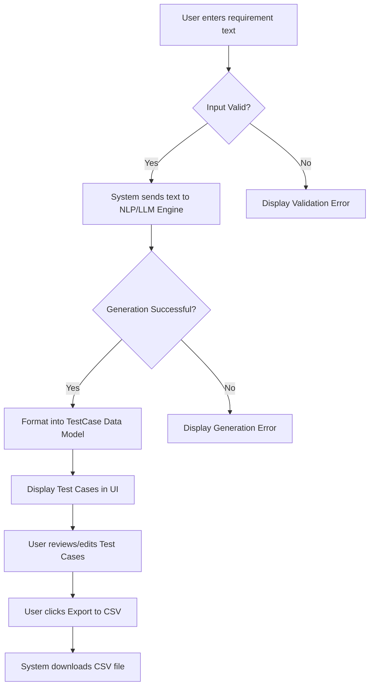

# Manual Test Case Generator (MTCG)
**ID**: MTCG-001
**Version**: 1.0
**Status**: Draft
**Type**: Functional Specification

## Overview & Purpose
Quality Assurance (QA) engineers and developers currently spend a significant amount of time manually translating user stories, requirements, and acceptance criteria into structured manual test cases. This process is time-consuming, prone to human error, and often lacks consistency in formatting and edge-case coverage. The Manual Test Case Generator (MTCG) is a tool designed to automate the creation of structured manual test cases from plain text requirements. By leveraging natural language processing, the system will parse requirements and output standardized, ready-to-execute test cases, thereby accelerating the testing lifecycle and improving overall software quality.

## Goals
*   **Reduce Test Creation Time**: Decrease the average time spent writing manual test cases by 50%.
*   **Standardize Formatting**: Ensure 100% of generated test cases adhere to a uniform structure (Title, Preconditions, Steps, Expected Results).
*   **Improve Test Coverage**: Automatically generate at least one negative/edge-case scenario for every requirement submitted.

## Target Users
*   **QA Engineers**: Primary users who will generate test cases to execute or import into test management tools.
*   **Business Analysts**: Users who will validate that their written requirements yield comprehensive test scenarios.
*   **Developers**: Users who need quick test scenarios to guide their unit and integration testing efforts.

## Stakeholders
*   **QA Lead**: Approves the output format and ensures it meets organizational testing standards.
*   **Product Manager**: Ensures the tool accurately interprets product requirements.
*   **Engineering Manager**: Monitors the tool's impact on development velocity and quality metrics.

## Scope (In / Out)
**In Scope**:
*   A user interface to input plain text user stories, requirements, or acceptance criteria.
*   Automated generation of positive (happy path) and negative (error state) manual test cases.
*   Output formatting in a standardized step-by-step structure.
*   Export functionality to CSV and Markdown formats.

**Out of Scope**:
*   Automated generation of executable test scripts (e.g., Selenium, Cypress, Playwright code).
*   Direct API integrations with third-party test management tools (e.g., Jira, Xray, TestRail) for version 1.0.
*   Execution of the generated test cases.

## MoSCoW
*   **Must Have**: 
    *   Plain text input field for requirements.
    *   Generation of step-by-step test cases (Title, Preconditions, Steps, Expected Results).
    *   Generation of both positive and negative test scenarios.
    *   CSV export functionality.
*   **Should Have**: 
    *   Markdown export functionality.
    *   Ability to edit generated test cases within the UI before exporting.
*   **Could Have**: 
    *   Customizable test case output templates.
    *   Bulk upload of requirements via CSV.
*   **Won't Have**: 
    *   Direct integration with Jira/TestRail (deferred to v2.0).
    *   Automated test script generation.

## Functional Requirements
*   **FR1: Requirement Input**: The system shall provide a text area allowing users to input up to 10,000 characters of plain text representing a user story or requirement.
    *   *Acceptance Criteria*: See AC1.
*   **FR2: Test Case Generation**: The system shall process the input text and generate a suite of manual test cases, each containing a Title, Type (Positive/Negative), Preconditions, Test Steps, and Expected Results.
    *   *Acceptance Criteria*: See AC2.
*   **FR3: Scenario Coverage**: The system shall generate at least one positive test case and at least one negative/edge-case test case for any valid input.
    *   *Acceptance Criteria*: See AC3.
*   **FR4: CSV Export**: The system shall allow users to download the generated test cases as a CSV file formatted with standard column headers.
    *   *Acceptance Criteria*: See AC4.
*   **FR5: In-App Editing**: The system shall allow users to modify the text of any generated test case field (Title, Steps, Expected Results) before exporting.
    *   *Acceptance Criteria*: See AC5.

## User Stories
*   **US1**: As a QA Engineer, I want to input a user story into a text field so that the system can generate standard manual test cases for it.
    *   *Given* I am on the generator page
    *   *When* I paste a user story into the input field and click "Generate"
    *   *Then* the system should display a list of structured test cases based on my input.
*   **US2**: As a QA Engineer, I want the generated test cases to explicitly include negative scenarios so that I do not miss critical edge cases during testing.
    *   *Given* the system has processed my user story
    *   *When* the results are displayed
    *   *Then* I should see at least one test case labeled as "Negative" or "Edge Case" alongside the "Positive" scenarios.
*   **US3**: As a QA Engineer, I want to export the generated test cases to a CSV file so that I can easily import them into my company's test management tool.
    *   *Given* the system has generated a list of test cases
    *   *When* I click the "Export to CSV" button
    *   *Then* a CSV file containing all generated test cases with appropriate column headers should be downloaded to my local machine.
*   **US4**: As a Business Analyst, I want to edit the generated test cases before exporting so that I can correct any misinterpretations made by the generator.
    *   *Given* the system has generated a list of test cases
    *   *When* I click on a specific test step or expected result
    *   *Then* the text should become editable, and my changes should be reflected in the final CSV export.

## Inputs, Outputs & Data Flow
**Inputs**:
*   `Requirement Text` (String): The raw text input provided by the user (User Story, Acceptance Criteria, or general requirements).

**Outputs**:
*   `Test Case List` (Array of Objects): The structured data displayed in the UI.
*   `CSV File` (File): The downloadable file containing the test cases.
*   `Markdown Text` (String): An alternative text-based output format.

**Data Entities / Models Touched**:
*   **TestCase**:
    *   `id` (UUID)
    *   `title` (String)
    *   `type` (Enum: Positive, Negative, Edge Case)
    *   `preconditions` (String)
    *   `steps` (Array of Strings)
    *   `expectedResult` (String)

## Flows & Diagrams

**Main (Happy) Flow**:
1. User navigates to the MTCG application.
2. User enters requirement text into the input area.
3. User clicks "Generate Test Cases".
4. System validates the input.
5. System processes the text (via LLM/NLP backend) to extract scenarios.
6. System formats the scenarios into the `TestCase` data model.
7. System displays the generated test cases in the UI.
8. User reviews and optionally edits the test cases.
9. User clicks "Export to CSV".
10. System generates and downloads the CSV file.

**Alternate / Exception Flows**:
*   *Empty Input*: If the user clicks "Generate" without entering text, the system halts and prompts the user to enter requirements.
*   *Irrelevant Input*: If the user enters text that does not resemble a requirement (e.g., random characters, a recipe), the system attempts generation but may return a message stating no testable scenarios could be identified.

## Edge Cases & Error States
*   **Input Exceeds Character Limit**: 
    *   *Failure Mode*: User pastes a massive document exceeding 10,000 characters.
    *   *Error Handling*: The UI prevents pasting beyond the limit and displays a warning: "Input exceeds the 10,000 character limit. Please truncate your text."
*   **Backend Processing Timeout**: 
    *   *Failure Mode*: The NLP/LLM engine takes too long to respond (e.g., > 30 seconds).
    *   *Error Handling*: The system aborts the request, stops the loading spinner, and displays: "Generation timed out. Please try again with a shorter requirement."
*   **Service Unavailable**: 
    *   *Failure Mode*: The backend generation service is down.
    *   *Error Handling*: Display a user-friendly error: "The test generation service is currently unavailable. Please try again later."
*   **Gibberish Input**: 
    *   *Failure Mode*: User inputs "asdfasdfasdf".
    *   *Error Handling*: The system processes the text, fails to find logical scenarios, and returns: "Could not identify testable scenarios from the provided text. Please provide a clear user story or requirement."

## Acceptance Criteria
*   **AC1 (Mapped to FR1)**: 
    *   *Given* I am on the main interface
    *   *When* I attempt to enter 10,001 characters into the input field
    *   *Then* the system restricts the input to 10,000 characters and displays a character limit warning.
*   **AC2 (Mapped to FR2)**: 
    *   *Given* I have entered a valid user story
    *   *When* the generation process completes
    *   *Then* every displayed test case must contain a non-empty Title, Type, Preconditions, at least one Test Step, and an Expected Result.
*   **AC3 (Mapped to FR3)**: 
    *   *Given* I have entered a valid user story
    *   *When* the generation process completes
    *   *Then* the resulting list of test cases must contain at least one item with the Type "Positive" and at least one item with the Type "Negative".
*   **AC4 (Mapped to FR4)**: 
    *   *Given* I have generated test cases
    *   *When* I click "Export to CSV"
    *   *Then* a file named `test_cases_[timestamp].csv` is downloaded, containing columns for Title, Type, Preconditions, Steps, and Expected Results.
*   **AC5 (Mapped to FR5)**: 
    *   *Given* test cases are displayed on the screen
    *   *When* I click on the "Expected Result" of the first test case, change the text, and click "Export to CSV"
    *   *Then* the downloaded CSV file must contain my updated text for that specific Expected Result.

## Non-Functional Requirements
*   **Performance**: The system must return generated test cases within 10 seconds for inputs under 5,000 characters, and within 20 seconds for inputs up to 10,000 characters.
*   **Usability**: The interface must be fully responsive and usable on standard desktop and tablet viewports (minimum width 768px).
*   **Security**: User input must not be permanently stored in the database after the session expires, ensuring proprietary requirements are not leaked or retained.
*   **Availability**: The system should maintain a 99.9% uptime during standard business hours.

## Assumptions
*   An external Large Language Model (LLM) API (e.g., OpenAI GPT-4 or similar) will be utilized as the backend engine to parse text and generate the test cases.
*   Users have a basic understanding of what constitutes a valid user story or requirement.
*   The target test management tools used by the QA team support standard CSV imports.

## Dependencies
*   **LLM Provider API**: The core generation functionality depends entirely on the availability and response quality of the chosen third-party NLP/LLM API.
*   **Frontend Framework**: Depends on standard web technologies (e.g., React/Vue) for state management of the editable test cases before export.

## Open Questions
*   What specific CSV schema (exact column names and order) is required to ensure seamless import into the organization's primary test management tool (e.g., Jira/Zephyr vs. TestRail)?
*   Should the system support custom system prompts (e.g., "Act as a security tester") to alter the flavor of the generated test cases in version 1.0?
*   Do we need to implement user authentication for v1.0, or will this be an internal, unauthenticated tool accessible via VPN?

## Success Metrics
*   **Adoption**: 80% of the QA team uses the tool at least once a week within the first month of launch.
*   **Efficiency**: A measured 50% reduction in the time taken from requirement finalization to test case readiness (measured via user surveys and Jira time-in-status tracking).
*   **Quality**: Less than 10% of generated test cases require major manual rewriting by QA engineers before execution.